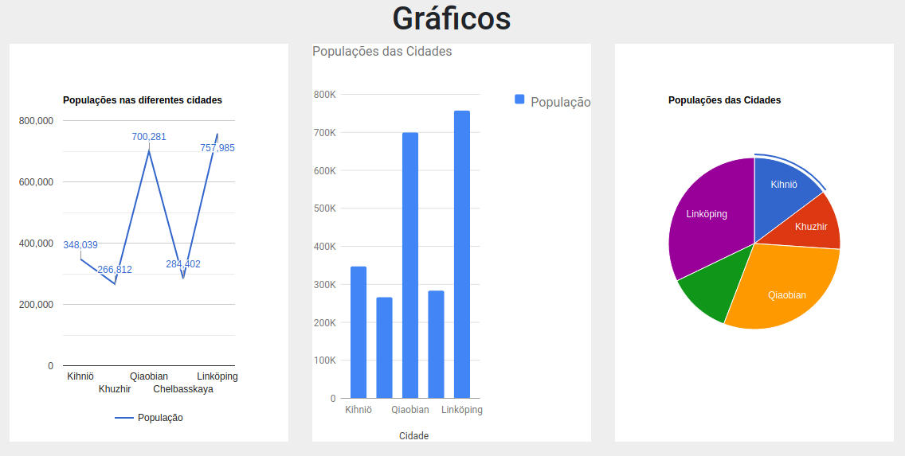

# Learning to work with dashboard using PHP, JavaScript and Google Charts

I am learning how to show show nice graphics in websites, lines, columns, pizza, etc

It is not too hard but it demands a lot of care

Feel free to use the codes you want the way you want too =)

If you want, you can see the course where I am learning this in the link above

[Udemy Classes in Portuguese](https://www.udemy.com/course/criando-um-dashboard-do-zero-com-phpmysql-e-bootstrap/learn/lecture/16224062#overview)

